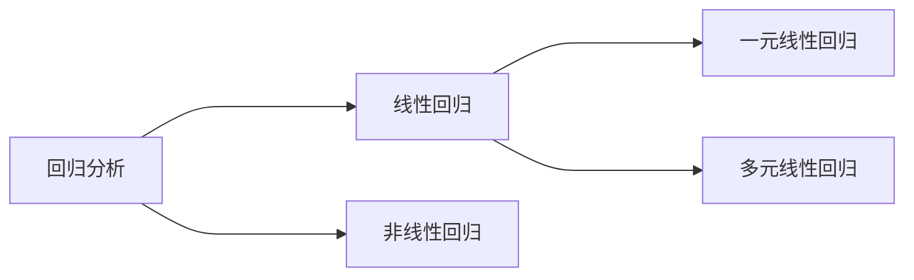

## 前言

福州好热，暑假又要开模了呜呜呜我的CS呜呜呜。趁着训练前终于把打了一年的MHW煌黑龙和黑龙通了，芜湖~~

<!--more-->

## 描述性分析

>描述性分析主要是对所收集的数据进行分析，得出反映客观现象和数量特征的一种分析方法，它主要包括数据的集中趋势分析、数据离散程度分析、数据的频数分布分析等，描述性分析是对数据进一步分析的基础。
>
>+ 分类变量：说明事物的类别，其数据是不连续（指数值上）、互不相容的（指不会同时满足复数个类别）。比如：性别
>+ 连续变量：其数据是连续的。比如：年龄

### 对分类变量进行频率分析

> # 注意SPSS中不支持中文数据，所以使用数值型+添加标签值的方式

1. 分析$\rightarrow$描述统计$\rightarrow$频率
2. 选择对应的分类变量
3. 图表$\rightarrow$条形图生成

### 对连续变量进行频率分析

1. 分析$\rightarrow$描述统计$\rightarrow$频率
2. 选择对应的连续变量
3. 统计$\rightarrow$选择一些条目
   + 四分位数：输出这组数据的四等分点
   + 分割点：输出这组数据的n等分点
   + 百分位数：输出这组数据的指定百分比点
   + 中位数、平均值、标准差、最小值、最大值
4. 图表$\rightarrow$直方图$\rightarrow$显示正态曲线

### 交叉表分析统计频率

>交叉表分析是用于分析两个或两个以上变量之间的关联关系，以交叉表格的形式进行分组变量间关系的对比分析。

1. 分析$\rightarrow$描述统计$\rightarrow$频率
2. 选择行（自变量）列数据（因变量）
3. 格式$\rightarrow$百分比选择列
4. 可以选择簇状条形图

## 数据异常值检验

1. 图形$\rightarrow$箱图$\rightarrow$简单，单独变量的摘要
2. 箱表示：移入需要检测的变量
3. 观察箱线图，除去异常值或将其设置为均值

## 数据正态分布检验

1. 分析$\rightarrow$描述统计$\rightarrow$探索
2. 全部选入因变量列表，图$\rightarrow$因子级别并置，茎叶图，含检验的正态图
3. 观察变量的显著性p值

##  相关分析和独立性检验

>相关关系是指现象之间存在着非严格的、不确定的依存关系。这种依存关长系的特点是：某一现象在数量上发生变化会影响另一现象数量上的变化，而且这种变化在数量上具有一定的随机性。即当给定某一现象一数值时，另一现象会有若干个数值与之对应，并且总是遵循一定的规律， 围绕这些数值的平均数上下波动，其原因是影响现象发生变化的因素不止一个。
>
>相关关系可分为线性相关和非线性相关，线性相关也称为直线相关，线性相关是最常用的一种，即当一 个连续变量发生变动时，另一个连续变量相应地呈线性 关系变动，用**皮尔逊（Pearson)相关系数**上来度量。 
>
>**皮尔逊相关系数**就是反映连续变量之间线性相关强度的一个度量指标，它的取值范围限于[-1, 1]。 r的正、负号可以反映相关的方向，当 r > 0 时表示表示 线性正相关，当 r < 0 时，线性负相关。 r的大小可以反映相关的程度，r = 0 表示两个变量之间不存在线性关系。一般认为0.3~0.8为中度相关。
>
>非线性相关某种意义来讲也就是曲线相关，一般不用相关系数度量其相关性。

### 相关分析

前提：两变量为**连续变量**，两变量之间为**线性相关**。数据服从正态分布且无异常值。

1. 绘制散点图大致判断是否为线性关系（图形$\rightarrow$简单散点图）

2. 计算相关系数（分析$\rightarrow$相关$\rightarrow$双变量）

3. 显著性检验，即上一步中得到的$Sig.$也就是所谓的P值

   >P值小于一般显著性水平（**一般为0.05**）则认为变量间存在显著性相关关系，小于0.01则具有极其显著的相关关系。P值大于一般显著性水平（一般为0.05）则认为变量间不存在显著性相关关系。

### 卡方独立性检验

前提：

1. 观测变量（因变量）是二分类变量（布尔变量）。

2. 分组变量（自变量）的类别大等于2。

3. 抽样是独立的。

4. 样本量足够大，最小的样本量要求分析中的任一单元**格期望频数大于5**

步骤：

1. 判断期望频数
   1. 分析$\rightarrow$描述统计$\rightarrow$频率$\rightarrow$交叉表
   2. 分组变量（自变量）放入行，观测变量（因变量）放入列
   3. 单元格$\rightarrow$取消实测$\rightarrow$选中期望
   4. 统计$\rightarrow$选中卡方
   5. 观察输出的交叉表，发现每个单元格的数值都大于5即可、
2. 计算卡方值
   1. 重复第1部分
   2. 单元格$\rightarrow$取消期望$\rightarrow$选中实测$\rightarrow$列
   3. 组间比较（当分组变量类别大于2时可选）：单元格$\rightarrow$z检验$\rightarrow$调整p值
   4. 观察输出的卡方检验表，其中渐进显著性为p值
   5. 组间比较：观察输入的交叉表，其中计数会出现字母，字母不同表示该类别的差异具有统计学意义，反之则无。

## 回归分析

联系：两者均为研究及测度两个或两个以上变量之间关系的方法。在实际工作中，一般先进行相关分析，计算相关系数，然后建立回归模型，最后用回归模型进行推算或预测。

区别：相关分析研究的都是随机变量，并且不分自变量与因变量，回归分析研究的变量要定义出自变量与因变量，并且自变量是确定的普通变量，因变量是随机变量。相关分析主要是描述两个变量之间相关关系的密切程度；回归分析不仅可以揭示变量x对变量y的影响程度，还可以根据回归模型进行预测。

### 一元线性回归

>一元线性回归，就是回归模型中只含一个自变量，它主要用来处理一个自变量与一个因变量之间的线性关系。简单线性回归模型为：$Y=a+bX+\varepsilon$，使用的时**最小二乘法**
>式中：
>Y--因变量；
>X--自变量；
>a--常数项，是回归直线在纵坐标轴上的截距；
>b--回归系数，是回归直线的斜率；
>$\varepsilon$--随机误差，即随机因素对因变量所产生的影响。

前提：两变量为**连续变量**，两变量之间存在线性关系

1. 根据预测目标确定因变量

2. 绘制散点图确定回归模型

3. 估计模型参数，建立线性回归模型

   1. 回归$\rightarrow$线性$\rightarrow$选择变量
   2. 图$\rightarrow$Y：DEP，X：ZRE（标准化残差）$\rightarrow$直方图，正态概率图
   3. 保存$\rightarrow$预测值：未标准化，残差：标准化，距离：库克，杠杆（显示异常点），预测区间：平均值，单值
   4. 选项：使用F的概率默认，在方程中包含常量

4. 对模型进行检验

   1. 除去变量表（除去没有相关性的变量）

   2. 线性回归模型汇总表：观察调整后R方

      >R方：判定系数。 值为0~1之间，越接近1,预测值与观测值越接近。一般认为，**R方大于0.75, 表示拟合程度很好**，小于0.5,表示拟合有问题，不适合回归分析，R方介两者之间说明拟合程度一般。

   3. 方差分析表ANOVA：观察显著性p值（通过F检验算出）

   4. 回归系数表：得到回归模型系数和常量，以及显著性p值（通过t检验算出）

   5. 观察残差直方图：因变量的残差值基本符合正态分布为好

   6. 观察残差正态p-p图：如果样本数据来自正态分布的话， 所有散点都应分布在对角线附近。说明样本数据比较正确。

### 多元线性回归

前提：

1. 需要至少2个自变量，且自变量之间互相独立
2. 因变量为为连续变量
3. 数据具有**方差齐性、无异常值和正态分布**的特点
4. 自变量间不存在多重共线性

步骤：

1. 检验并去除异常值

2. 检验是否为正态分布

3. 检验方差齐性（莱文或者ANOVA）

   1. 分析$\rightarrow$描述统计$\rightarrow$探索

   2. 设置因变量为预测变量，因子列表为自变量

   3. 图$\rightarrow$因子级别并置，茎叶图，莱文未转换

   4. 观察莱文方差齐性检验的显著性p值是否大于0.05

      >莱文检验原假设$H_0$：各组方差相等，符合方差齐性

   1. 分析$\rightarrow$比较均值$\rightarrow$单因素ANOVA检验

   2. 将预测变量设置为因变量，但需要注意的是，ANOVA检验无法将名义变量设为因子

   3. 选项$\rightarrow$方差齐性检验

   4. 观察方差齐性检验的显著性p值是否大于0.05

      >检验原假设$H_0$：各组方差相等，符合方差齐性

4. 检验多重共线性

   1. 分析$\rightarrow$回归$\rightarrow$线性

   2. 输入自变量和因变量

   3. 统计$\rightarrow$共线性诊断

   4. 关注系数表，当$VIF$值大于等于10时，我们认为变量间存在严重的共线性。

      当$VIF$值小于10时，我们认为数据基本符合多元线性分析的假设，即不存在多重共线性问题。

5. 分析$\rightarrow$回归$\rightarrow$线性

6. 填入自变量和因变量

7. 统计

   

8. 保存$\rightarrow$预测值：未标准化，残差：学生化，学生化后删除，距离：库克，杠杆（显示异常点），包含协方差矩阵 

9. 对模型进行检验

   1. 除去变量表（除去没有相关性的变量）
   2. 线性回归模型汇总表：观察调整后R方
   3. 方差分析表ANOVA：观察显著性p值（通过F检验算出）
   4. 回归系数表：得到回归模型系数和常量，以及显著性p值（通过t检验算出），以及VIF

10. 结果表述

    

### 多元线性逐步回归

>逐步法结合向前法和向后法的优点，在向前引入每一个新自变量之后都要重新对已代入的自变量进行计算，以检验其有无继续保留在方程中的价值，并以此为依据进行自变量的引入和剔除交替进行，直到没有新的变量可以引入或剔除为止，此法较为准确。

前提：同多元线性回归

1. 检验并去除异常值

2. 检验是否为正态分布

3. 检验方差齐性（莱文或者ANOVA）

4. 检验多重共线性

5. 分析$\rightarrow$回归$\rightarrow$线性

6. 填入自变量和因变量，方法选择步进

7. 统计：估算值，模型拟合，共线性诊断，德斌沃森残差分析

8. 保存：学生化，杠杆值，协方差矩阵

9. 对模型进行检验

   1. 残差统计表：在满足假设后，我们还需要依据残差统计表中的库克距离（cook值）来判断数据有无强影响点，若库克距离的最大值大于1，则应检查数据是否存在的异常值；若库克距离的最大值小于1，则数据中不存在强影响点，可以进行下一步的分析。
   2. 模型纳入变量表：去除不重要的变量
   3. 模型摘要表：表下的注释可以看出逐步回归分析中每一步引入回归方程的自变量。观测调整后R方
   4. ANOVA表：此检验的零假设是多重相关系数R=0。如果P<0.05，就说明多重线性回归模型中至少有一个自变量的系数不为零。同时，回归模型有统计学意义也说明相较于空模型，纳入自变量有助于预测因变量；或说明该模型优于空模型。
   5. 回归模型系数表：显著性检验结果，当P>0.05时，该自变量在本模型中没有统计学意义，应当在回归模型中删除相应变量；反之保留。

10. 表述

    

### 非线性回归

1. 绘制散点图，大致确定关系
2. 曲线估算
   1. 分析$\rightarrow$回归$\rightarrow$曲线估算
   2. 填入因变量和独立（自变量）
   3. 选择可能的模型
   4. 观察模型和参数估计表，有R方和显著性p值，选择R方优越的模型
   5. 根据参数估计值得到曲线表达式

## 参考

[SPSS多元线性回归分析](https://mp.weixin.qq.com/s?__biz=MzUxNzAxMDY5NQ==&mid=2247483917&idx=1&sn=8c2358dbf63fa5785bc7a0d0e8937932&chksm=f99fe665cee86f73a702f1552a3589d6934e5263031624964b640521c8de71bae94838eff632&scene=178&cur_album_id=1354525438097539072#rd)

[2022校赛赛前培训SPSS基础](https://www.bilibili.com/video/BV133411K7yd)