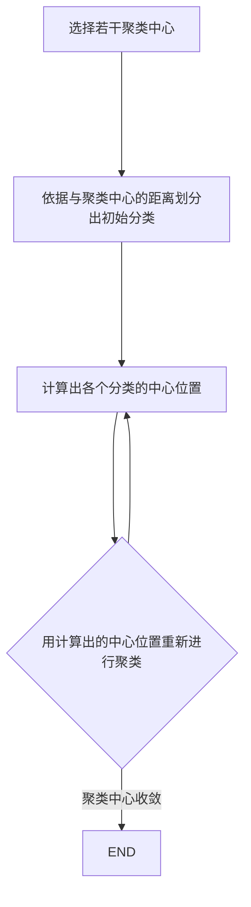

## 前言

6 月 23 日、『Honkai Impact 3』の新メインライン発売まで 10 時間、『Rise of SunBreak』の発売まで 7 日です。 もう我慢できない！ テレビゲームがしたい！

<!--more-->

## 标准化数据

>​    大型数据分析项目中，数据来源不同，量纲及量纲单位不同，为了让它们具备可比性，需要采用标准化方法消除由此带来的偏差。原始数据经过数据标准化处理后，各指标处于同一数量级，适合进行综合对比评价。这就是数据标准化。
>
> **基本原理**：z-score 标准化。数值减去平均值，再除以其标准差，得到 **均值为 0，标准差为 1** 的服从 **标准正态分布** 的数据。

1. 分析 $\rightarrow$ 描述统计 $\rightarrow$ 描述
2. 将标准化值另存为变量（Z）

## 归一化数据

> 主要是为了数据处理方便提出来的，把数据映射到 0～1 范围之内处理，把有量纲表达式变为无量纲表达式。

1. 分析 $\rightarrow$ 描述统计 $\rightarrow$ 描述

2. 选项 $\rightarrow$ 最小值、最大值

3. 转换 $\rightarrow$ 计算变量
   $$
   x^* = \frac{x-min}{max-min}
   $$

## 聚类分析

> 聚类分析是一种探索性分析方法，与判别分析不同，**聚类分析事先并不知道分类的标准，甚至不知道应该分成几类，** 而是会根据样本数据的特征，自动进行分类。严格说来聚类分析并不是纯粹的统计技术，它不像其它多元分析法那样，需要从样本去推断总体。一般都涉及不到有关统计量的分布，也不需要进行显著性检验。假定研究对象均用所谓的“点”来表示。 在聚类分析中，一般的规则是将“距离”较 小的点归为同一类，将“距离”较大的点归为不同的类。 常见的是对个案分类，也可以对变量分类， 但对于变量分类此时一般使用相似系数作为 “距离”测量指标。
>
> 目的：使属于同一类别的数据间的 相似性尽可能大，不同类别中的数据间的相似性尽可能小
>
> **注意：** 聚类分析更像是一种建立假设的方法，而对于相关假设的检验还需要借助其他统计的方法，比如判别分析、T-检验、方差分析等，看聚类出来的几个类别是否存在差异

+ 从统计学的观点看，聚类分析是通过数据建模简化数据的一种方法。

+ 从机器学习的角度看，簇相当于隐藏模式。聚类是搜索簇的无监督学习过程。

+ 从实际应用的角度看，聚类分析是数据预处理（降维）和信息挖掘的主要任务之一。

常规步骤：

1. 选择聚类指标（经验、主成分分析、因子分析）
2. 数据标准化处理（K-means 需要预处理，其余 SPSS 集成）
3. 选择聚类方法：样本容量，变量类型
4. 确定分类个数
5. 进行结果解读

## K 均值聚类（K-means Cluster）

+ 聚类对象：个案（Q 型聚类分析）

+ 变量类型：连续变量
+ 分类数：固定
+ 样本容量：大样本

### 流程

整个 K-means 是一个自平衡的过程，其不断划分类别，然后用某些规则（比如重心）计算聚类中心，再重新根据聚类中心划分类别，如此不断迭代，直到某次循环结果与上次一致或者达到迭代上限。

### 优缺点

优点：

1. 原理比较简单，实现也很容易，**收敛速度快**。
2. 在对大规模数据集进行聚类分析时，算法聚类较高效且聚类效果较好。
3. 簇与簇之间区别明显时，它的聚类效果很好。

缺点：

1. 分类数从 **初始分类开始就确定不变** 了，所以要求事先要对样本有足够的了解。
2. 仅限于 **个案间的聚类**（Q 型聚类）, 不能对变量进行聚类。
3. 个案间的距离的测量方法使用的是 **欧式距离的平方**，因此只能对连续变量进行聚类。

### SPSS 过程

1. 对变量进行标准化处理
2. 分析 $\rightarrow$ 分类 $\rightarrow$ k 均值聚类
3. 选择个案变量（比如 ID），其余变量放置于变量，设置聚类数。
4. 迭代 $\rightarrow$ 默认迭代十次
5. 保存 $\rightarrow$ 聚类成员
6. 统计 $\rightarrow$ 初始聚类中心，ANOVA，每个个案的聚类信息
7. 结果分析
   1. 初始聚类中心、最终聚类中心和迭代历史记录（若不收敛调整迭代次数）
   2.  ANOVA：**聚类均方** 对应组间均方差，**误差均方** 对应组内均方差，显著性 p < 0.05 且**组间均方差大于组内均方差**时说明此变量组别之间差异明显，分类可信度较高。
   3. 聚类成员明细
8. 由于可能经过标准化处理，最后的结果是标准化的数值。如果要查看聚类中心原本的数值
   1. 分析 $\rightarrow$ 比较均值 $\rightarrow$ 均值
   2. 选择标准化前的变量作为因变量，案例的类别号作为自变量
   3. 选项 $\rightarrow$ 单元格统计量只要均值

## 系统聚类（分层聚类）

+ 聚类对象：个案或变量

+ 变量类型：连续变量或分类变量
+ 分类数：固定或指定范围
+ 样本容量：中小样本

### 流程

### 优缺点

优点：

1. 距离和规则的相似度容易定义，限制少。
2. 既可对分类变量聚类，也可对连续变量聚类。
3. 事先不需要确定要分多少类，系统会自动确定最佳分类数。

缺点：

1. 运行较慢，适合样本容量较少
2. 系统聚类分析时，每个个案一旦归为某一类就不允许再改变，但最初的分类可能不是最优的选择。

### SPSS 过程

1. 分析 $\rightarrow$ 分类 $\rightarrow$ 系统聚类
2. 聚类可以选择个案（标注个案变量）或者变量
3. 统计 $\rightarrow$ 集中计划，近似值矩阵
4. 图 $\rightarrow$ 谱系图，取消冰柱图
5. 方法 $\rightarrow$ 标准化：Z 得分（按变量）；聚类方法：一般而言组间联接是最好的，ward 法聚类出来会比较平均；度量标准：个案一般用平方欧式距离，变量一般用皮尔逊相关系数
6. 结果分析

## 二阶聚类（TwoStep Cluster）

+ 聚类对象：个案或变量

+ 变量类型：连续变量和分类变量
+ 分类数：自动确定
+ 样本容量：大样本

### 优缺点

优点：

1. 能够 **同时处理分类变量和连续变量**
2. 可自动选择最优的分类个数
3. 适用于大样本数据

缺点：

1. 聚类结果主要受所选择的变量影响。如果去掉一些变量，或者增加一些变量，结果会很不同
2. 分类变量应服从 **多项分布**，连续变量应服从 **正态分布**（但其实会自动剔除异常值）

### SPSS 过程

1. 检验正态分布（分类变量多项分布一般都是满足的）

2. 检验共线性，去除无关变量

3. 分析 $\rightarrow$ 分类 $\rightarrow$ 两步聚类

4. 按照变量类型分开为分类变量和连续变量，剩余一个为个案变量

5. 选项 $\rightarrow$ 连续变量标准化

6. 输出 $\rightarrow$ 选择透视表；将个案变量作为判断字段；创建聚类成员变量

7. 结果分析：

   1. 自动聚类表：

      > 根据施瓦茨贝叶斯准则（BIC)帮助 **判断最佳分类数量**，从统计上分析，该数值越小聚类效果越好。但是实际中还要考虑 BIC 变化量、BIC 变化比率和距离测试比率，可以通过他们进一步确定最佳分类数。
      > 判断标准：
      >
      > 1. BIC 准则数值越小，聚类效果越好；
      > 2. BIC 变化量数值越小，聚类效果越好；
      > 3. 距离测量比率数值越大，聚类效果越好。

   2. 聚类分布，质心：不同类的总体情况

   3. 模型概要：聚类质量图反映聚类效果的好坏，双击可进入详细模式，然后左下角查看 $\rightarrow$ 聚类，接着可以点击某些属性来 **查看变量重要性**，或者多选某些属性来查看 **各类别对比**。

      