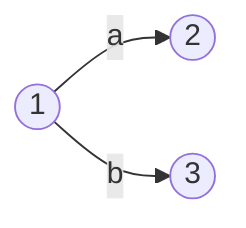

## 前言

嘿嘿嘿，boki酱可爱捏

<!--more-->

## 概述

### 词法分析的任务

**词法分析器** 需要做的就是从左至右逐个字符地对源程序进行扫描，识别一个个单词符号，具体而言：

1. **消除无用字符**，对源程序文本进行处理，消除源程序文本中的注释、空格、换行符及其他一切对语法分析和代码生成无用的信息

2. **识别单词**，扫描源程序的一个个字符，按照语言的词法规则，识别出各类有独立意义的单词

3. 对识别出来的单词进行 **内部编码**。将长度不一、种类不同的单词用长度统一、格式规整、分类清晰的内部编码表示

4. 建立各种 **表格**（如名字特征表、常数表等）

编译程序实现词法分析时，可以进行单独一遍扫描，也可以和语法分析放在同一遍扫描中

### 单词的分类与表示

通常在程序设计语言中，可以将单词分为以下几类

1. 关键字：如 begin, repeat, if,...
2. 界限符：逗号、分号、括号和空白
3. 运算符：+,-,*,/,...
4. 常数：各种类型的常数
5. 标识符一表示各种名字：如变量名、数组名和过程名

对于单词的表示，通常要先对其进行 **分类** 然后进行 **编码**。通常将单词编码分为两部分：**类别编码** 和 **单词自身编码**，并以一个二元组的形式给出。

单词的类别编码有两种方案：

1. 一类一种：根据单词的五大种类进行划分，为每一类分配一个类型码
2. 一字一种：即设计之初就定义下来，比如 `for` 就是 12 之类的

关键字、运算符、界限符等专用符号在语言设计之初其属性就不会再发生变化，因此其 **自身编码值** 可以直接固定。而对于标识符和常量这种单词的自身值编码同样也有两种方案：

1. 标识符单独为一种，自身的值表示成按照机器字节划分的内部码；常数按照类型分种，常数的值则表示为标准的 2 进制数形式
2. 引入符号表，将标识符和常量分别放入相应的表中，用表中的相对地址码作为单词的值

## 词法分析程序

词法分析程序分为手工编码实现方案和利用自动生成器两种，前者相对比较复杂、易出错但效率较高，生成的词法分析程序的代码量较少（GCC\LLVM)。后者可快速成型，代码量少，但较难控制细节，调优比较难（Lex\Flex\Jlex 等）

### 状态转移图

转换图实际上是一个 **有限方向图**，图中结点代表 **状态**，用 **圆圈** 表示。状态之间用 **有向边** 连接，有向边上标记某个符号，其含义是某一状态下，如果当前的输入符号是有向边上标记的符号，则转换到另一状态或留在原状态

**转换图只能存在一个初态和至少一个终态（双圈表示）**

该状态转换图表示在状态 1 下读 a 转到状态 2，若在状态 1 下读入字符 b，则转到状态 3

同样的，一个状态转换图可以用于识别一定的字符串，例如 C 语言表视符的转换图：

其中，S 为 **初态**，Z 为 **终态**。这个状态转换图识别（接受）标识符的过程：从初态 S 开始，若编译器扫描到了一个字母或下画线，则读入该字母或下画线，并转入状态 1；在状态 1 下，若编译器又扫描到了一个字母或下画线或数字，则仍然读进，并再次进入状态 1，重复这个过程，直到在状态 1 下发现编译器扫描到的符号不再是字母或下画线或数字时，进入状态 Z。状态 Z 是终态，它意味着到此已识别出一个 C 语言的标识符，识别过程 **宣告终止**。终态 Z 的右上角有一个 **星号**，这表示读进了一个不属于标识符的符号（如界限符、空格等），应把它退还给输入串，用于识别下一个单词

### 左线性文法构造状态转移图

正规文法包含左线性文法和右线性文法。词法规则往往可以采用正规文法来构造，而状态转换图恰恰又可用于识别单词，因此它们之间实际存在“等价”关系。所以可以将正规文法转换为状态转换图

令文法 ${G}=({V}_{{N}}, {V}_{{T}}, {P}, {Z})$ 是一个左线性文法, 并假设 $|{V}_{{N}}|={n}$， 则构造出的状态转换图共有 ${n}+1$ 个状态, 其对应的状态转换图构造步骤如下 (其中 $U, B \in V_N, a, c \in V_T$ )

1. 将每个 **非终结符号** 设置成一个对应的 **状态**, 文法的 **开始符号** $Z$ 所对应的状态为 **终止状态**
2. 在图中增加一个结点 $S$ 作为 **初始状态**，$S$ 并非文法中的符号
3. 对于 ${G}$ 中形如 $U arrow a$ 的规则，从初始状态 $S$ 向状态 $U$ 引一条箭弧，并标记为 $a$ 
4.  对于 ${G}$ 中形如 ${U} arrow {Bc}$ 的规则，从状态 ${B}$ 向状态 ${U}$ 引一条箭弧，并标记为 ${c}$ 

栗子：设有左线性文法 $G=(V_N, V_T, P, Z), V_N=\{Z, A, B\}, V_T=\{0,1\}$，其中 $P$ :

$$
{Z} \rightarrow {A} 0|{~B} 1 \quad {~A} \rightarrow {Z} 1| 1 \quad {~B} \rightarrow {Z} 0 \mid 0
$$

则：

首先明确一点，左线性文法构造状态转移图是根据规则反向（自底向上）进行推理的

不难发现，首先从 $S$ 出发，利用右部只有终结符的规则 $B \to 0,\ A \to 1$ 得到状态 $A,\ B$，然后用 $Z \to A0|B1$ 获得 $A \to^0 Z,\ B \to^1 Z $。最后根据 $A \to Z1, \ B\to Z0$，构造剩下两条由 $Z$ 出发的路径

那么这个具体的用处是什么呢？答曰：识别某个字符串 $x$ 是否为该文法下的合法句子，如果其从初始状态 $S$ 出发，与 $x$ 余留部分中最左字符相匹配的原则，游历状态转换图，直到 $x$ 读入最后一个符号为止。如果这时恰好到达状态 $Z$(即文法的开始符号），则 x 是该文法所产生的句子（单词）之一，否则不是

比如识别字符串 $101001$，其路径如下

通过路径还可以还原其语法树：

可见，这颗树是向左生长的（左线性）。事实上，该文法最终生成的语言为 $\{ 01,10   \}^+$

### 右线性文法构造状态转移图

令文法 ${G}=({V}_{{N}}, {V}_{{T}}, {P}, {Z})$ 是一个右线性文法, 并假设 $|{V}_{{N}}|={n}$， 则构造出的状态转换图共有 ${n}+1$ 个状态, 其对应的状态转换图构造步骤如下 (其中 $U, B \in V_N, a, c \in V_T$ )

1. 将每个 **非终结符号** 设置成一个对应的 **状态**, 文法的 **开始符号** $Z$ 所对应的状态为 **终止状态**
2. 在图中增加一个结点 $S$ 作为 **初始状态**，$S$ 并非文法中的符号
3. 对于 ${G}$ 中形如 $U arrow a$ 的规则，从状态 $U$ 向终止状态 $Z$ 引一条箭弧，并标记为 $a$ 
4. 对于 ${G}$ 中形如 ${U} arrow {cB}$ 的规则，从状态 ${U}$ 向状态 ${B}$ 引一条箭弧，并标记为 ${c}$ 

不难发现，右线性文法构造时，是顺序（自顶向下）推理的

栗子，设有右线性文法 ${G}[S]=({V}_{N}, {V}_{T}, {P}, S), {V}_{N}=\{S, {A}, {B}, {C}\}, {V}_{T}=\{0,1\}$, 其中 ${P}$ :
$$
{S} \rightarrow 1 {~A}|0 {~B} \quad {~A} \rightarrow 0 {C}| 0 \quad {~B} \rightarrow 1 {C}|1 \quad {C} \rightarrow 0 {~B}| 1 {~A}
$$
则

事实上，该文法最终生成的语言同为 $\{ 01,10   \}^+$，可称其与上文左线性文法为 **左右线性文法等价，不同状态转移图等价，正规文法和状态转移图等价**。换言之，状态转移图，等价左右线性文法是知一求二的关系

## 自动词法分析程序

### 正规表达式

正规表达式是一种通过符号组成的式子来表达语言（句子集合）的方式。它简单、直观，与 **集合** 的表现形式更为相近，因此应用起来也更为方便

每一类程序设计语言都有它自己的 **字符集** $\Sigma$，语言中每一个单词可以是 $\Sigma$ 的单个有意义的字符（如运算符、分隔符等），也可以是 $\Sigma$ 上的字符按一定方式组成的有意义的字符串（如常数、保留字、标识符及关系运算符等）。如果我们把每类单词均视为一种“语言”，那么 **每一类单词都可用一个正规表达式** 来描述。正规表达式表示的“语言”叫作 **正规集**

**正则表达式和正规集**：

1. 定义 $\varepsilon$ 和 $\varnothing$ 是 $\Sigma$ 上的正规表达式，它们所表示的正规集分别为 $\{\varepsilon\}$ 和 $\varnothing$
2. 对于每一个 $a \in \Sigma$，$a$ 即为 $\Sigma$ 上的正规表达式，定义它表示的正规集为 $\{a\}$
3. 反之，如果 $\Sigma$ 上的某些集合 **不能用正规表达式表示**，则该集合不是正规集

**正规表达式和正规集的运算：**

如果 $e_1$ 和 $e_2$ 是 $\Sigma$ 上的正规表达式, 定义它们所表示的正规集分别为 $L(e_1)$ 和 $L(e_2)$， 则:

1. $e_1 \mid e_2$ 是正规表达式，$\mid$ 表示选择，其相应正规集为 $L(e_1 \mid e_2)=L(e_1) \cup L(e_2)$
2.  $e_1 \cdot e_2$ 是正规表达式，$\cdot$ 表示连接 其相应正规集为 $L(e_1 \cdot e_2)=L(e_1) L(e_2)$，通常 **省略** $\cdot$
3. $({e}_1)^*$ 是正规表达式，$*$ 表示克林闭包，其相应正规集为 ${L}(({e}_1)^*)=({L}({e}_1))^*$ 
4. **有限次** 使用上述步骤定义的表达式才是 $\Sigma$ 上的正规表达式。仅由这些正规表达式所表示的符号串集合才是 $\Sigma$ 上的正规集
5. 这三个运算符的运算优先级为 $*,\ \cdot,\ \mid$
6. 除了这三个运算符之外，还可以使用 **圆括号** 改变运算顺序

> 栗子：$\Sigma = \{a,b\}$，求正规表达式对应的正规集
> 
> 

> 栗子 2：
>
> 1. 十进制整数的 RE：$(1\mid ...\mid 9)(0\mid ...\mid 9)^*\mid 0$
> 2. C 语言中八进制整数的 RE：$0(1\mid ...\mid 7)(0\mid...\mid 7)^*$
> 3. C 语言中十六进制整数的 RE：$0x(1\mid ...\mid F)(0\mid ...\mid F)$

**正规表达式的等价**：若两个正规式所对应的 **正规集** 相同，则认为两者等价

> 栗子 3： $e_1=b(a b)^* \quad e_2=(b a)^* b$
>$$
>\begin{aligned}
>&L(e_1)=L(b(a b)^*)=L(b)(L(a b))^*=\{b\}\{a b\}^*=\{b, b a b, b a b a b, \ldots\} \\
>&L(e_2)=L((b a)^* b)=(L(b a))^* L(b)=\{b a\}^*\{b\}=\{b, b a b,  babab, , \ldots\}
>\end{aligned}
>$$
> 所以 $e_1 = e_2$

**正规表达式的性质**：

1. 交换律：$e_1 \vert e_2 = e_2\vert e_1$
2. 加法结合律：$e_1 \vert (e_2\vert e_3) = (e_1 \vert e_2)\vert e_3$
3. 乘法结合律：$e_1 (e_2 e_3) = (e_1 e_2) e_3$
4. 分配律：$e_1  (e_2\vert e_3) = e_1e_2 \vert e_1e_3$
5. 空串连接：$\varepsilon e_1 = e_1 \varepsilon = e_1$
6. 空集合积：$\varnothing e_1= e_1 \varnothing  =\varnothing$
7. 循环：$(e^*)^* = e^*$
8. 循环：$(\varepsilon \vert e)^* = e^*$

**正规定义**：给给定的正规表达式起一个别名，比如可以用 $hex \to 0x(1\mid ...\mid F)(0\mid ...\mid F)$ 进行 16 进制数的正则定义，记为 $hex$

### 有穷自动机

如前所述，使用 **正规文法** 或 **正规表达式** 可以定义语言的词法结构。在 **手动编写方式** 中，我们将正规文法转换成状 **态转换图**，根据状态转换图可以较为方便地编写出词法分析程序。对于计算机而言，状态转换图的描述方式是不易理解的，也不适合用于 **自动生成词法分析程序**。因此需要引入状态转换图的 **形式化描述工具**——**有穷自动机**，从识别语言的角度出发，确定某种模型来判断一个符号串是否是给定语言的句子

有穷自动机（Finite Automata，FA）也被称为有穷状态自动机或有穷状态系统，它是一种数学模型，这种模型对应的系统 **具有有穷数目的内部状态**，系统的状态概括了对过去输入的处理情况。系统根据当前所处的状态和面临的输入就可以决定后续行为。每当系统处理完当前的输入，系统的内部状态也会发生改变。有穷自动机分为确定的有穷自动机（Deterministic Finite Automata，DFA）和非确定的有穷自动机（Non-Deterministic Finite Automata，NFA），下面分别给出它们的形式化定义。

FA 定义的语言：给定输入串 $x$, 如果存在一个对应于串 $x$ 的从初始状态到某个终止状态的转换序列，则称串 $x$ 被该 FA 接收由一个有穷自动机 $M$ 接收的 **所有串构成的集合** 称为是该 FA 定义（或接收）的 **语言**，记为 $L(M)$

FA 的最长子串匹配原则（贪婪原则）：当输入串的多个前缀与一个或多个模式匹配时，总是选择最长的前缀进行匹配

### 确定的有穷自动机

 一个确定的有穷自动机（DFA）由一个五元组 $M$ 定义, 即 $M=({K}, {V}_{{T}}, M, S, Z)$

+ ${K}$ 是状态有穷的非空集合，${K}$ 中每一个元素是一个状态

+ ${V}_{{T}}$ 是一个有穷输入字母表， ${V}_{{T}}$ 中的每一个元素称为输入字符
+ $M$ 是 $K \times V_T$ 到 $K$ 的单值映射（函数），即 $M(q, a)= p, q, p \in K, a \in V_T$ ，它表示：当前状态为 ${q}$，输入字符为 ${a}$ 时, 将转到下一状态 ${p}$，${p}$ 是 ${q}$ 的一个后继状态。**由于映射是单值, 所以称确定的有穷自动机**
+ $S$ 为初始状态, 是唯一初态, $S \in {K}$
+ ${Z}$ 是终止状态集合，${Z}$ 是 ${K}$ 的子集

**状态转移图**：所以，我们可以通过这个五元组绘制出 **DFA** 的状态转移图。一个 **DFA** 可唯一表示一张确定的状态转换图。假定一 **DFA** 有 $m$ 个状态和 $n$ 个输入字符，则它的状态转换图含有 $m$ 个状态，每个结点最多有 $n$ 条箭弧和别的状态相连接，每条箭弧用 $V_T$ 中的一个输入字符标记，整个图含有唯一的初态和若干个终态。

**状态转移矩阵**：一个 **DFA** 还可以用一个状态转换矩阵来表示，矩阵的 **行表示状态**，**列表示输入字符**，矩阵元素表示映射 $M(q,a)=p$

**DFA 输入符号串**：定义如下：

1. $M({q}, \varepsilon)={q}, {q} \in {K}$，一个状态输入空符号串回到自身

2. $M(q, a t)=M(M(q, a), t)=M(p, t)=\cdots$, 其中 $a \in V_T, t \in V_T^*$ 

   当状态为 $q$，输入字符串为 $at$ 时，利用映射 $M({q}, {a})$ 得到状态 ${p}$，然后利用映射 $M({p}, {t})$，如此重复。如果对某一字符串 $x$，有 $M(S, x)=r$，而 $r \in Z$，则称字符串 $x$ 被 $(DFA)M$ **接受**

**DFA 接受集**：将可被接受的字符串全体称为自动机 $M$ 的 **接受集** 或 **所接受的语言**，记作 $L(M)$

> 栗子：(DFA) $M=(\{0,1,2,3\},\{a, b\}, M, 0,\{3\})$，其中 ${K}=\{0,1,2,3\}$，${V}_{{T}}=\{a, b\}$
>
> 对于输入字符串 $a b b$, 因为从初始状态 0 出发, 有
>$$
>\mathrm{M}(0, \mathrm{a})= 1 \quad \mathrm{M}(1, \mathrm{~b})= 2 \quad \mathrm{M}(2, \mathrm{~b})= 3
>$$
> 当输入完最后一个字符 ${b}$ 时, 到达了终止状态 3 , 所以字符串 $a b b$ 能被此 DFA 所接受 (识别)。
>
> 其状态转移图：
>
> 
>
> 其状态转移矩阵：
>
>| 状态\输入 | a    | b    |
>| --------- | ---- | ---- |
>| 0         | 1    | 2    |
>| 1         | 3    | 2    |
>| 2         | 1    | 3    |
>| 3         | 3    | 3    |
>
> 显然，该自动机所接受的语言 $L(M)$ 为 $\{a,b\}^+$ 且至少含有相继两个 $a$ 或 $b$

###  非确定的有穷自动机

非确定的有穷自动机（NFA）与确定的有穷自动机的唯一区别就在于映射 $M$

$M$ 是 $K \times V_T$ 到 ${K}$ 的 **幂集**（所有子集的集合）上的映射，即 $\{K \times V_T arrow 2^K\}$

$M(q, a)=\{p_1, p_2, \cdots, p_n\} \in 2^K, {q} \in K, a \in V_T$ ，表示：当前状态为 ${q}$，输入字符为 ${a}$ 时，映射 $M$ 将产生一个状态集合 $\{p_1, p_2, \cdots, p_n\}$ （可能是空集），而不是单个状态，所以 **称非确定的有穷自动机**

**NFA 输入符号串**：

1. $M(q, \varepsilon)=\{q\}, q \in K$
2. 

$$
\begin{aligned}
\mathrm{M}(\mathrm{q}, \mathrm{at})
&=\mathrm{M}(\mathrm{M}(\mathrm{q}, \mathrm{a}), \mathrm{t})\\
&=\mathrm{M}(\{\mathrm{p}_1, \mathrm{p}_2, \cdots, \mathrm{p}_{\mathrm{n}}\}, \mathrm{t}) \\
&=\cup \mathrm{M}(\mathrm{p}_{\mathrm{i}}, \mathrm{t})
\end{aligned}
$$
其中, ${i}$ 从 1 变到 ${n}, {p}_i \in M({q}, {a}), {a} \in {V}_T, {t} \in {V}_T^*$ ，如此继续。对于 ${V}_{{T}}{ }^*$ 上的字符串 ${x}$, 令 $S_0 \in S$，若集合 $M(S_0, {x})$ 含有属于终态集 ${Z}$ 的状态，**或者至少存在一条从某一个初态结点到某一个终态结点的路径**，且这条路径上所有箭弧的标记字符连接起来的字符串等于 $x$, 我们就说 $x$ 为 $N F A(M)$ 所接受 (识别)

**NFA 接受集**：一个 ${NFA}(M)$ 所接受的 ${V}_{{T}}{ }^*$ 中的全体字符串称为 $M$ 的接受集或 $M$ 所接受的语言, 记为 ${L}(M)$

> 栗子：
>
>
>
>状态转移图：
>
>
>
>状态转移矩阵：
>
>| 状态\输入 | 0             | 1             |
>| --------- | ------------- | ------------- |
>| S0        | {S0, S3}      | {S0, S1}      |
>| S1        | $\varnothing$ | {S2}          |
>| S2        | {S2}          | {S2}          |
> | S3        | {S4}          | $\varnothing$ |
>| S4        | {S4}          | {S4}          |
> 
>对于此 NFA，若输入字符串 `10010`，判断其是否为可被识别的符号串：
> $$
>\begin{aligned}
>M(S_0, 10010) &=M(S_0, 0010) \cup M(S_1, 0010) \\
>&=M(S_0, 010) \cup M(S_3, 010) \\
>&=M(S_0, 10) \cup M(S_3, 10) \cup M(S_4, 10) \\
>&=M(S_0, 0) \cup M(S_1, 0) \cup M(S_4, 0) \\
>&=\{S_0, {~S}_3, {~S}_4\}
>\end{aligned}
>$$
>因为 $M(S_0, 10010)=\{S_0, {~S}_3, {~S}_4\} \cap {Z} \neq \varnothing$, 所以字符串 10010 为此 NFA 所接受。显然，从状态转换图的初始状态 $S_0$ 出发，有路径至终止状态 $S_4$ 

+ 显然的，如果一个语言能被 NFA 接受，则一定能被 DFA 接受

#### 将非确定的有穷自动机确定化的方法

上文说到 NFA 之所以不确定，是因为其存在到集合的映射。而将 NFA 转化为 DFA 的关键就在于，将这些 **集合视作新的状态**（其实就是穷举法），下面给出定义：

设( ${NFA}) M=({K}, {V}_{{T}}, M, S, {Z})$ 是 ${V}_{{T}}$ 上一个 ${NFA}$， 构造一个等价的 $(DFA)M^{\prime}=({K}^{\prime}, {V}_{{T}}, M^{\prime}, S^{\prime}, {Z}^{\prime})$

1. $K^{\prime}$ 由 $K$ 的全部子集组成, 即 $K^{\prime}=2^K$ （一般除去空集 $\{\varepsilon\}$，所以 $size(K^\prime) = 2^{size(K)}-1$）

   例如，若 ${K}=\{S_1, {~S}_2, {~S}_3\}$，则 ${K}$ 的一个子集 $\{S_1, {~S}_2\}$ 表示 ${K}^{\prime}$ 的一个状态，用记号 $[S_1, {~S}_2]$  表示，也可 **重新命名**

2.  ${V}_{{T}}={V}_{{T}}$ 

3. $S^{\prime}=[S]$ (例如, $S=\{S_1, {~S}_2\}$, 则 $S^{\prime}=[S_1, {~S}_2]$ )

4. ${Z}^{\prime}=\{[S_1, {~S}_2, \cdots, S_{{n}}][[S_1, {~S}_2, \cdots, S_{{n}}] \in {K}^{\prime}..$ 且 $.\{S_1, {~S}_2, \cdots, S_{{n}}\} \cap {Z} \neq \varnothing\}$ 

5. $M^{\prime}([S_1, {~S}_2, \cdots, S_{{i}}], {a})=[{R}_1, {R}_2, \cdots, {R}_{{j}}], \quad {a} \in {V}_{{T}}$

简而言之，状态集合变成原本的 **幂集**，输入集合不变，起始状态不变（换了个符号），终止状态变为只要新的状态集合中含有原本的终止状态即是新的终止状态，映射的改变从 NFA 的 **状态到集合** 的映射变为 **集合到集合** 的映射，这一部分可以看看下面栗子辅助理解

> $(NFA)M=(\{S_0, {~S}_1\},\{a, b\}, M,\{S_0\},\{S_1\})$，其中 ${K}=\{S_0, {~S}_1\}, V_T=\{{a}, b\}$ ，尝试将其转换为 $DFA$
>$$
>\begin{array}{ccc}
>M: M(S_0, {a})=\{S_0, {~S}_1\} 
>\\M(S_0, {~b})=\{S_1\} 
>\\M(S_1, {a})=\varnothing 
>\\M(S_1, {~b})=\{S_0, {~S}_1\}
>\\S=\{S_0\}  
>\\{Z}=\{S_1\}
>\end{array}
>$$
> NFA 状态转移矩阵：
>
>|      | a             | b        |
>| ---- | ------------- | -------- |
>| S0   | {S0, S1}      | {S1}     |
>| S1   | $\varnothing$ | {S0, S1} |
>
> 将 $\{S_0,S_1\}$ 视作新的状态，其映射为 $S_0$ 的映射与 $S_1$ 映射的 **交集**
>
> DFA 状态转移矩阵：
>
>|          | a             | b        |
>| -------- | ------------- | -------- |
>| S0       | {S0, S1}      | {S1}     |
>| S1       | $\varnothing$ | {S0, S1} |
>| {S0, S1} | {S0, S1}      | {S0, S1} |
>
> 重新命名状态，令 $[S_0] =A,\ [S_1]= B,\ [S_0,\ S_1] =C$ 得
>
>|      | a             | b    |
>| ---- | ------------- | ---- |
>| A    | C             | B    |
>| B    | $\varnothing$ | C    |
>| C    | C             | C    |
>
> DFA 状态转移图：
>
> 
>
>+ 因为原本的终止状态 $Z = \{S_1\}$，所以包含 $S_1$ 的状态都是新的 DFA 的终止状态

上述栗子中原 NFA 只有两个元素，数目较少，但倘若数目增加呢？我们的状态转移矩阵不可能列出 $2^n-1$ 行把？而且可能很多状态都是不可达的，根本必要必要出现。所以需要用 **子集法** 的方式优化，子集法的思想其实就是 `DFS`

1. 从起始位置出发
2. 每次将能到达的新的位置写入下一行
3. 重复第 2 步，直到不会到达新的位置

总结一下，从 NFA 到 DFA 的过程如下：

1. 写出 NFA 的状态转移矩阵（草稿）
2. 利用子集法从开始状态写出 DFA 的状态转移矩阵
3. 重命名状态
4. 画出 DFA 的状态转移图

### 自动生成词法分析程序的原理

1. 对于同一字母表，存在 NFA 与 DFA，两者接收的语言相同
2. 正规文法产生的语言可以用 FA 表示，反之亦成立
3. 每个右线性文法总有一个左线性文法等价，反之亦成立
4. $\mathrm{L}$ 是正规集 $\Leftrightarrow$ 存在一个有穷自动机(FA)M，使得 $\mathrm{L}=\mathrm{L}(\mathrmM)$
   $\Leftrightarrow$ 存在一个正规文法 $\mathrm{G}$，使得 $\mathrm{L}(\mathrmM)=\mathrm{L}(\mathrm{G})$
   $\Leftrightarrow$ 存在一个正规表达式 $e$，使得 $\mathrm{L}(\mathrm{e})=\mathrm{L}(\mathrm{G})$

#### 状态转移图逆向正规文法

对于一个左线性文法 $G[E]:U\to a,\ U\to Ba,\ U,B\in V_N,\ a\in V_T$，我们可以很简单地构建出其状态转移图。

但其中可能存在一些需要解决的问题，比如

1. 存在两个终止状态：将其中一个终止状态用 $\varepsilon $ 连接另一终止状态。这样保证文法的入口唯一（只有一个终止状态）

   

2. 初始状态存在引入边

   
   $$
   \begin{aligned}
   &{Z}::={A a} \mid {S b} \\
   &{A}::={S a} \\
   &{S}::={A a} \\
   
   \end{aligned}
   $$
   
   
   可以对其进行等价转换（引一个结点 $T$ 用 $\varepsilon$ 连接 $S$）
   
   
   $$
   \begin{aligned}
   &{Z}::={A a} \mid {S b} \\
   &{A}::={S a} \\
   &{S}::={A a} \\
   &{S}::=\varepsilon
   \end{aligned}
   $$
   并整理化简
   $$
   \begin{aligned}
   &{Z}::={A a}|{S b}| {b} \\
   &{A::}={S a} \mid {a} \\
   &{S}::={A a}
   \end{aligned}
   $$

同样的，对于一个右线性文法，我们也很简单地构建出其状态转移图（注意与左线性文法区别）。所以我们可以用状态转移图作为桥梁，来构建等价的左右线性文法

##### 正规文法转换正规表达式

所谓“一个文法所对应的正规表达式”，就是这个文法的开始符号所能推导出的 **所有句子的凝练表示**

对于右线性文法中常见的 $X \to aX\mid b$，则其生成的正规表达式中就含有解 $X = a^*b$

同样的，对于左线性文法 $X\to Xa\mid b$，则其生成的正规表达式中就含有解 $X = ba^*$

##### 左右线性文法的等价转换

已知左线性文法，求等价的右线性文法，可将左线性文法的状态转移图画出来，根据状态转移图写出等价的右线性文法

##### 由正规表达式转换 DFA

显然，在构建 **DFA** 之前要先构建 **NFA** 作为一个转换系统，为了转换图的简洁，约定要确保确拥有 **唯一的开始状态 S 和终止状态 Z**。**初始状态只有引出**，**终止状态只有引入**

| 正规式        | 转换系统                                                     | 正规式        | 转换系统                                                     |
| ------------- | ------------------------------------------------------------ | ------------- | ------------------------------------------------------------ |
| $\varnothing$ |  | $e_1\mid e_2$ |  |
| $\varepsilon$ |  | $e_1e_2$      |  |
| $e$           |  | $e^*$         |  xx |

> 栗子：一个正规表达式 $({a} \mid {b})^*({a a} \mid {b} {b})({a} \mid {b})^*$ 将其转换为 DFA
>
> 初始化：
>
> 
>
> 连接展开：
>
> 
>
> 克林闭包和或展开
>
> 
>
> 或和连接展开
>
> 

如此一来，我们就构造完了 NFA，然后考虑之前的学过的将 NFA 转换为 DFA

+ 带有空边的 NFA 转换比较特别，空边可以理解为与某个输入进行连接，但是必须要能接受某个输入。比如上图中的 B 无法接受 0，所以即使存在 B 到 C 的空边也不行。又比如 A 输入 1，A 可以经由空边变为 B 接受$\varepsilon 1$，或者接受之后再变为 C 接受$\varepsilon 1\varepsilon$

根据状态转移矩阵（转移表省略了 start）可以画出 DFA，首先是初始状态，显然不需要任何条件可以达到 A，B，C。**由于 C 为终止状态，所以新的 ABC 也是终止状态**（接受一个空串）。剩下的过程同上，很容易构造出 DFA 的状态转移图

形式化一下以上内容，**子集构造法**（subset construction）。然后抛出几个概念

1. $\varepsilon - closure(I)$：状态子集 $I$ 的 $\varepsilon-$ 闭包。起始就是一个集合，包含 $I$ 状态集合（$I\in K$）和从 $I$ 开始经过 **若干条** $\varepsilon$ 能达到的状态集合
2. $move(I,a)$：书上定义为 $Ia$，表示从 $I$ 中某个状态出发，通过 **一条** 标号 $a$ 的转换达到的状态集合

其转化步骤如下：

1. 构造一张表，它共有 $|\Sigma|+1$ 列， 第一列为状态子集 $\mathrm{I}$， 然后对每个 $\mathrm{a} \in \Sigma$ 分别设一列 $\mathrm{Ia}$
2. 第一行第一列的状态子集 $I$ 为 $\varepsilon-closure(\{S\})$ 。 $S$ 为初始状态
3. 为第一列中的 $\mathrm{I}$ 和每个 $\mathrm{a} \in \Sigma$， 求 $\mathrm{Ia}$， 并记入相应 $\mathrm{I} a$ 列， 如果它不同于第一列中已有状态子集 $I$， 则将它列入第一列中（发现了新的状态）
4. 重复(3)， 直到对每个 $\mathrm{I}$ 及 $\mathrm{a} \in \Sigma$ 均已求得 $\mathrm{Ia}$， 并且没有新的状态子集加入第一列时为止（上述过程在有限步后必可终止， 因为状态子集个数是有限的 $2^K-1$）
5. 将第一列中每个状态子集作为一个新状态， 并重新命名， 把每个 Ia 看作是相应输入符号， 把 其余的状态子集随第一列中的状态子集做相应的重命名， 作为状态转换函数值， 这样一个表 就是相应的确定有穷自动机 DFA 的状态转换矩阵。含有初始状态的状态子集命名的状态是新初始状态， 含有终止状态的状态子集命名的状态是新终止状态。

##### 确定的有穷自动机 DFA 化简

化简（最小化）即寻找一个状态数比原本少的 DFA，使得任何两个不同子集的状态是可区别的，而同一子集的状态是等价的

**状态等价：** 对于一个给定的 (DFA) M，假定有两个不相同状态 $S_1$ 和 $S_2$ ，如果从状态 $S_1$ 出发能扫描符号串 $w$ 而 **停止于某个终态**。同样，从状态 $S_2$ 出发也能扫描符号串 $w$ 而 **停止于某个终态**，反之亦然，则称状态 $S_1$ 和 $S_2$ 是等价的

**状态可区分：** 若两不同状态不等价，则称它们是可区分的。即 **存在** 一个符号串 $w$，要么 $S_1$ 读出 $w$ 停止于终态而 $S_2$ 读出
$w$ 停止于非终态，要么 $S_1$ 读出 $w$ 停止于终态而 $S_2$ 读出 $w$ 停止于非终态。当 $w = \varepsilon $ 时，显然可以得到 **终态和非终态是可区分的**

状态等价的两个条件：

1. 一致性条件：状态 $S_1$ 和 $S_2$ 必须同为终态或者非终态
2. 蔓延性条件：对于所有输入符号，状态 $S_1$ 和状态 $S_2$ 必须转移到终态或者等价的状态里

具体的化简方法：

1. 首先去除掉不可达的多余状态
2. 把 DFA 中的状态集分别划成一些 **不相交子集**，使得任何不同的两个子集的状态是 **可区分的**，而同一子集中的任何两个状态是 **等价的**（初始为终态集和非终态集）
3. 然后对每个集合 $I^i$ 进行考察，考察方式为读入符号 $a$ 后是否等价，不等价就继续划分。直到每个集合内所有状态全部等价。考察方式：
   1. 计算 $I^i_a$，判断其中是否含有现行划分中的 **不同子集的状态**
   2. 如果有，则将其根据子集目的地为组划分出去。反之都在同一组就不用操作
4. 分划结束后，对分划中的每个状态子集，选出一个状态作代表，而删去其它一切等价的状态，并把射向其它状态的箭弧改为射向这个作为代表的状态。若某子集含有原来的初态，则其代表为新的初态，若某子集含有原来的终态，则其代表为新终态

> 栗子：已知状态转移图如下，对其进行化简（最小化）
>
> 
>
> 解：
>
> 1. 首先根据终态和非终态进行划分：$I^1 = \{0,1,2\},\ I^2 = \{3,4,5,6 \}$
> 2. 对 1 集合考察 a：$I^1_a = \{1,3\}$，所以划分新的集合 $I^{11} = \{0,2\}$ 和 $I^{12} =\{1\}$
> 3. 对 11 集合考察 b：$I_b^{11} = \{2,4 \}$，所以划分新的集合 $\{0\}$ 和 $\{2\}$
> 4. 对 2 集合考察 a：$I^2_a =\{3,6\}$，在同一集合中无需划分
> 5. 对 2 集合考察 b：$I^2_b = \{4,5\}$，在同一集合中无需划分
> 6. 所以最后的集合为 $\{0\}\{1\}\{2\}\{3,4,5,6\}$，重命名为 0，1，2，3。并确定开始状态和终止状态
>
>​	
>
> 

